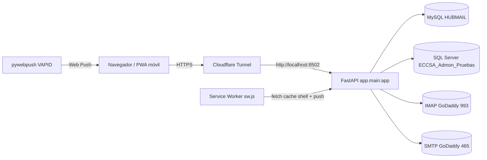
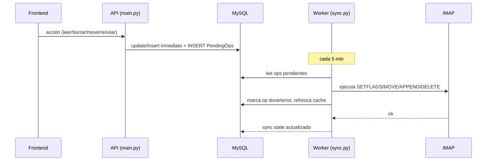

# ARCHITECTURE.md — HUBMail

## Visión general

## Componentes

- **`app/main.py`** — FastAPI, único proceso. Sirve `/api/*` y estáticos (`/static`, montados en `/`). Arranca el hilo de sync de fondo (`_background_sync_loop`). ~50 endpoints.
- **`app/sync.py`** — Worker de sincronización. `SYNC_INTERVAL = 300` (5 min). Único módulo que **escribe a IMAP** (flags, move, append, delete) mediante la cola `HUBMAIL_PendingOps`. También aplica filtros, retención y dispara push al llegar correos nuevos.
- **`app/imap_client.py`** — `IMAPClient` (imaplib), charset cp1252/UTF-7, parseo MIME, descarga de cuerpos/adjuntos.
- **`app/smtp_client.py`** — Envío SMTP; `send_mail` devuelve el RFC822 completo (`outer.as_bytes()`) para guardarlo en Enviados.
- **`app/auth.py`** — JWT (HS256) + `authenticate` contra SQL Server de usuarios.
- **`app/crypto.py`** — Cifrado AES de contraseñas de cuentas con clave en `/data/.hubmail_key`.
- **`app/filters.py`** — Antispam: DNSBL (Spamhaus ZEN), filtros por cuenta/globales, acciones (leído/spam/eliminar/mover).
- **`app/push.py`** — Web Push: suscripciones en `HUBMAIL_PushSubscriptions`, envío VAPID vía pywebpush.
- **`app/db.py`** — Wrapper `_MySQLConnection` para que PyMySQL exponga la misma API que pymssql (`cursor(as_dict=True)`, commit/rollback, autocommit). `get_conn()` MySQL, `get_users_conn()` pymssql.
- **`app/config.py`** — Dataclass `Settings` con defaults por env (`HUBMAIL_*`) + VAPID.
- **`app/signature.py`** — Firma HTML por cuenta (logo ECCSA embebido en base64, frases aleatorias).
- **Frontend `static/`** — `index.html`, `app.js` (único, vanilla), `style.css`, `sw.js`, `manifest.json`, iconos. SW network-first para GET no-`/api/`, cache del shell, handlers `push`/`notificationclick`.
- **`deploy.ps1`** — Build y despliegue remoto vía plink/SSH + Docker.

## Bases de datos

### MySQL `HUBMAIL` (principal, schema `migrations_mysql/0001..0006`)
Tablas: `HUBMAIL_Accounts`, `Contacts`, `Unread`, `SyncState`, `Messages` (cache, UQ por AccountID/Folder/UID), `UserSettings`, `Admins`, `SpamLists`, `Filters`, `AddressBook`, `UserMeta`, `Attachments`, `Folders`, `Retention`, `ActivityLog`, `PendingOps` (cola IMAP), `PushSubscriptions`.
- `Messages` guarda cuerpo (`BodyHtml`, `BodyText`), flags, spam, `SenderIP`.
- `Attachments` (LONGBLOB) con `Cid` para imágenes inline.
- `PendingOps`: `OpType` ∈ {seen, flag, delete, move, append}; estado `pending`/`done`/`error`; `RawMessage LONGBLOB` para append.
- Migraciones se aplican al arrancar el contenedor con `apply_migrations.py` (y localmente).

### SQL Server `ECCSA_Admon_Pruebas` (usuarios)
- `HUB_Users` (login de empleados), `HUB_BingWallpapers` (fondo de login).
- Conexión charset `cp1252`.

## Flujo principal

1. Usuario hace login → JWT (auth contra SQL Server).
2. `GET /api/accounts` → cuentas asignadas (admin ve todas). Folders desde `HUBMAIL_Folders` (cargadas por sync).
3. Listas/detalle/notificaciones/no leídos se sirven **desde BD** (caché), sin tocar IMAP en el request.
4. El hilo de sync (5 min por cuenta) refresca carpetas, mensajes, adjuntos; aplica filtros/retención; aplica `PendingOps` pendientes (escribe a IMAP); encola notificaciones push si hay correos nuevos en INBOX.
5. Acciones de escritura del usuario (leído/no leído, flag, eliminar, mover, enviar) hacen **DB inmediato + enqueue** en `PendingOps`; el sync aplica el cambio a IMAP en el próximo ciclo.
6. Enviar: `send_mail` → SMTP; luego op `append` con el RFC822 → worker hace APPEND a la carpeta Sent detectada (ver DEC-002).
7. Push: `/api/push/config` entrega VAPID pública; `app.js` suscribe; el sync llama `notify_new_mail`.

## Flujo de escritura IMAP (cola)

## Archivos de soporte
- `apply_migrations.py` — aplica `migrations_mysql/*.sql` en orden (tabla interna de aplicadas).
- `migrate_sqlserver_to_mysql.py` — migración histórica SQL Server→MySQL.
- `docker-compose.yml` / `Dockerfile` — imagen Python 3.11-slim, ejecuta migraciones + uvicorn.
- `.credenciales.env` / `.gitignore` — secretos locales (NO commiteados).